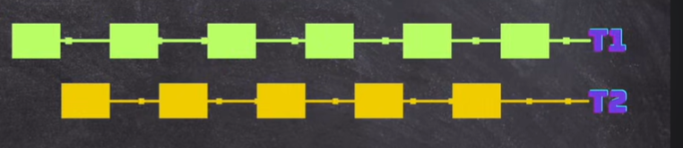

every thread has it's own registors and cache memory
every thread in a same process shares a common memory

parralelism vs concurrency
time slicing 

when we have enough CPU

then thread1 entirely runs on one CPU(or core)

thread context switch is expensive when threads are too much

Thread has life cycle

new state (before start)

Active state (after start)

    Runnable

    Running

Blocked (waiting) -> (mainly in time slicing)

Terminated

Sequential Execution
Thread class vs Runnable